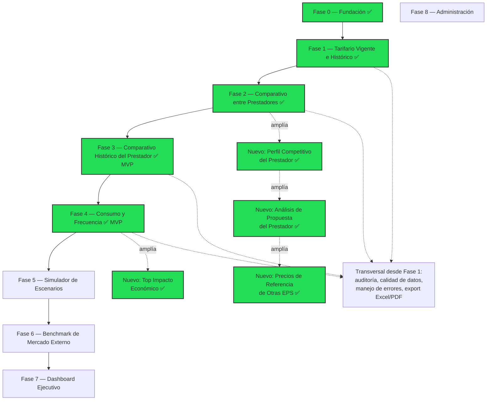

# Roadmap

Orden de construcción incremental: **cada módulo se cierra al 100% (UI + Server Actions + pruebas con datos reales) antes de iniciar el siguiente.** Fuente: `docs/ARQUITECTURA.md` §5.

> [!warning] Actualizado 2026-08-02 — el roadmap real se ramificó del plan original
> Las Fases 3 y 4 **sí se construyeron** (como MVP, sin el ETL de pre-agregación originalmente planificado — ver nota abajo) y el equipo agregó **4 módulos nuevos no contemplados en `docs/ARQUITECTURA.md`**, todos ya en producción al 2026-07-31: Perfil Competitivo del Prestador, Análisis de Códigos de Mayor Impacto Económico, Análisis de Propuesta del Prestador y Precios de Referencia de Otras EPS. El orden real de construcción no siguió estrictamente el orden secuencial de fases originalmente planeado (ej. el Módulo 8/Administración sigue sin construirse mientras ya existen 4 módulos "extra"). Detalle completo, con fecha de cada hito, en [[Contratación]] y [[API]].

## Detalle de fases

| Fase | Alcance | Estado |
|---|---|---|
| **0 — Fundación** | Scaffold Next.js 15, `db.ts`/proxy, middleware de sesión, layout base, tabla y login de `negociacion_contratacion_usuario` | ✅ Completada (código); ⚠️ migración pendiente de aplicar en BD — ver [[Pendientes]] |
| **1 — Tarifario Vigente e Histórico** | Consulta en vivo (sin ETL) de contratos y tarifarios de ARYUWIS: listado `/tarifarios` con filtros/paginación server-side, detalle `/tarifarios/[id]` con pestañas Procedimientos/Medicamentos/Insumos/Paquetes/Otros, export Excel/CSV/impresión | ✅ **Completada e implementada** (2026-07-28) — ver [[Arquitectura General#4. Módulos funcionales]] y [[Contratación]] |
| **2 — Comparativo entre Prestadores** | Reutiliza y limpia la lógica estadística validada del componente original (media/mediana, semáforo, deduplicación por mejor precio), pero **siempre dentro del mismo municipio** (regla nueva pedida por el usuario). Incluye la pestaña "Dashboard Analítico de Riesgo Contractual" (Fase A, score 0-100, ranking, heatmap, ahorro potencial) agregada el 2026-07-29 | ✅ **Completada e implementada** (2026-07-28, ampliada 2026-07-29) — ver [[Arquitectura General#4. Módulos funcionales]] y [[Contratación#Reglas implementadas — Módulo 2]] |
| **3 — Comparativo Histórico del Prestador** | Compara la tarifa vigente de HOY de un prestador contra la foto congelada de `historico_tarifas_2025` (2 puntos, no serie temporal real) — mismo semáforo del Módulo 2, ahora contra el propio histórico del prestador. Ruta `/historico-prestador` | ✅ **Completada como MVP** (2026-07-28→29) — ver [[Contratación#Reglas implementadas — Módulo 3 (Comparativo Histórico del Prestador) ✅ MVP]] |
| **4 — Consumo y Frecuencia** | Consulta en vivo (sin ETL) de RIPS reales (`rips_ap/am/at`) por prestador y rango de fechas (tope de seguridad 92 días), con el patrón de rendimiento "filtrar `rips_af` primero, saltar a tablas grandes por `consecutivo_rips` indexado". Ruta `/consumo-frecuencia` | ✅ **Completada como MVP** (2026-07-28, ampliada 2026-07-30) — ver [[Contratación#Reglas implementadas — Módulo 4 (Consumo y Frecuencia) ✅ MVP]] |
| **5 — Simulador de Escenarios** | Módulo nuevo: proyectar impacto de una tarifa propuesta contra consumo histórico | ⏳ No iniciada |
| **6 — Benchmark de Mercado Externo** | Ingesta batch de SISMED/datos.gov.co u otras fuentes — **fuera del alcance inicial**, se aborda después de validar Fases 0-5. **No confundir** con "Precios de Referencia de Otras EPS" (ya implementado, ver abajo) — ese es un módulo distinto, alimentado manualmente por el analista, no por ingesta batch de fuentes públicas | ⏳ No iniciada |
| **7 — Dashboard Ejecutivo** | Se construye al final: consume/resume todos los módulos anteriores | ⏳ Placeholder visual en `/dashboard` |
| **8 — Administración** | Gestión de usuarios y exclusiones de calidad de datos | ⏳ No iniciada — solo existe la tabla `negociacion_contratacion_usuario`; primer uso real de `tieneRolMinimo()` fue el botón "Aplicar migración" del módulo de Precios de Referencia EPS, no un módulo de administración propiamente dicho |

## Módulos nuevos — no contemplados en `docs/ARQUITECTURA.md` original

| Módulo | Ruta | Qué es | Estado |
|---|---|---|---|
| **Perfil Competitivo del Prestador** | `/perfil-prestador` | Un prestador puntual contra sus pares del mismo municipio, todos los municipios donde opera a la vez — complementa al Módulo 3 (temporal) con la dimensión de pares | ✅ Completado (2026-07-29) |
| **Análisis de Códigos de Mayor Impacto Económico** | `/top-impacto` | Ranking Top 100 EPS-completa (todos los prestadores) de procedimientos/medicamentos/insumos por valor radicado, con drill-down de 3 niveles hasta factura individual | ✅ Completado (2026-07-29→30) |
| **Análisis de Propuesta del Prestador** | `/analisis-propuesta` | Evalúa un archivo de propuesta de tarifas de un prestador (nuevo o renegociando) contra el mercado local ya contratado, genera contrapropuesta en Excel con columnas dinámicas | ✅ Completado (2026-07-31) |
| **Precios de Referencia de Otras EPS** | `/precio-referencia-eps` | Carga manual de precios que otras EPS pagan por código+municipio, para anexar como referencia adicional en Análisis de Propuesta | ✅ Completado (2026-07-31) — tabla `negociacion_contratacion_precio_referencia_eps` con DDL escrito, aplicable desde la propia UI (botón "Aplicar migración", rol `admin`) |

Ver metodología completa de cada uno en [[Contratación]] y contrato de API en [[API]].

> [!note] Por qué este orden
> El Módulo 1 (Tarifario) es la base de todo lo demás. Los Módulos 3 y 4 se construyeron como MVP consultando RIPS en vivo (con el patrón de rendimiento validado, ver [[Contratación]]) en vez de esperar al ETL de pre-agregación originalmente planificado — decisión tomada con el usuario tras verificar con `EXPLAIN ANALYZE` que el rendimiento en vivo era aceptable para el alcance acordado (un prestador/mes a la vez en Consumo, comparación de 2 puntos en Histórico). El Simulador (5) y el Dashboard Ejecutivo (7) siguen dependiendo de que exista una base de datos agregada más robusta si se necesita proyectar por volumen real, no solo por unidad tarifada.

> [!info] Alcance temporal de trabajo — contratos 2025 en adelante
> El equipo de Contratación trabaja con contratos **desde 2025 hasta la fecha actual** (no hay necesidad de consultar histórico anterior a 2025 en el uso normal del Módulo 1). El filtro de vigencia (`esContratoVigente()`, ver [[Contratación]]) ya cubre esto por fecha (`fecha_inicio <= hoy <= fecha_terminacion`) sin necesidad de un filtro de año adicional; el listado `/tarifarios` seguirá mostrando cualquier contrato existente en ARYUWIS, pero el foco operativo diario es 2025+.

## Ver también
- [[Visión General]]
- [[Objetivos]]
- [[Pendientes]]
- [[Arquitectura General]]
- [[Contratación]]
