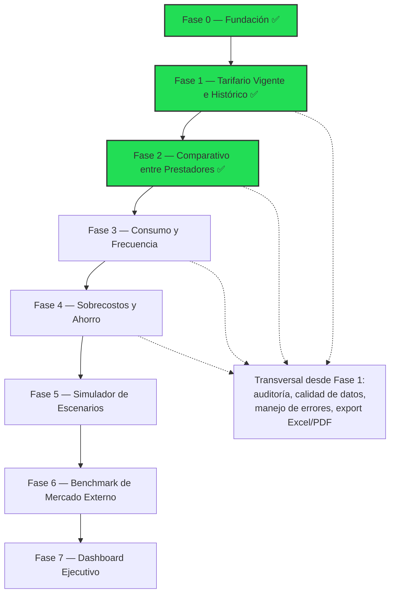

# Roadmap

Orden de construcción incremental: **cada módulo se cierra al 100% (UI + Server Actions + pruebas con datos reales) antes de iniciar el siguiente.** Fuente: `docs/ARQUITECTURA.md` §5.

## Detalle de fases

| Fase | Alcance | Estado |
|---|---|---|
| **0 — Fundación** | Scaffold Next.js 15, `db.ts`/proxy, middleware de sesión, layout base, tabla y login de `negociacion_contratacion_usuario` | ✅ Completada (código); ⚠️ migración pendiente de aplicar en BD — ver [[Pendientes]] |
| **1 — Tarifario Vigente e Histórico** | Consulta en vivo (sin ETL) de contratos y tarifarios de ARYUWIS: listado `/tarifarios` con filtros/paginación server-side, detalle `/tarifarios/[id]` con pestañas Procedimientos/Medicamentos/Insumos/Paquetes/Otros, export Excel/CSV/impresión | ✅ **Completada e implementada** (2026-07-28) — ver [[Arquitectura General#4. Módulos funcionales]] y [[Contratación]] |
| **2 — Comparativo entre Prestadores** | Reutiliza y limpia la lógica estadística validada del componente original (media/mediana, semáforo, deduplicación por mejor precio), pero **siempre dentro del mismo municipio** (regla nueva pedida por el usuario) | ✅ **Completada e implementada** (2026-07-28) — ver [[Arquitectura General#4. Módulos funcionales]] y [[Contratación#Reglas implementadas — Módulo 2]] |
| **3 — Consumo y Frecuencia** | Introduce el ETL de agregación de RIPS — la pieza más pesada en rendimiento | ⏳ No iniciada |
| **4 — Sobrecostos y Oportunidades de Ahorro** | Cruza fases 1-3; corrige el umbral inconsistente del componente original (% configurable, no pesos absolutos) | ⏳ No iniciada |
| **5 — Simulador de Escenarios** | Módulo nuevo: proyectar impacto de una tarifa propuesta contra consumo histórico | ⏳ No iniciada |
| **6 — Benchmark de Mercado Externo** | Ingesta batch de SISMED/datos.gov.co u otras fuentes — **fuera del alcance inicial**, se aborda después de validar Fases 0-5 | ⏳ No iniciada |
| **7 — Dashboard Ejecutivo** | Se construye al final: consume/resume todos los módulos anteriores | ⏳ No iniciada |

> [!note] Por qué este orden
> El Módulo 1 (Tarifario) es la base de datos de todo lo demás. El Módulo 3 (Consumo) introduce el ETL más pesado (RIPS: ~177M + ~81M + ~60M filas) antes de intentar cruces financieros en el Módulo 4. El Simulador (5) y el Dashboard (7) dependen de que los anteriores ya tengan datos reales que proyectar/resumir.

> [!info] Alcance temporal de trabajo — contratos 2025 en adelante
> El equipo de Contratación trabaja con contratos **desde 2025 hasta la fecha actual** (no hay necesidad de consultar histórico anterior a 2025 en el uso normal del Módulo 1). El filtro de vigencia (`esContratoVigente()`, ver [[Contratación]]) ya cubre esto por fecha (`fecha_inicio <= hoy <= fecha_terminacion`) sin necesidad de un filtro de año adicional; el listado `/tarifarios` seguirá mostrando cualquier contrato existente en ARYUWIS, pero el foco operativo diario es 2025+.

## Ver también
- [[Visión General]]
- [[Objetivos]]
- [[Pendientes]]
- [[Arquitectura General]]
