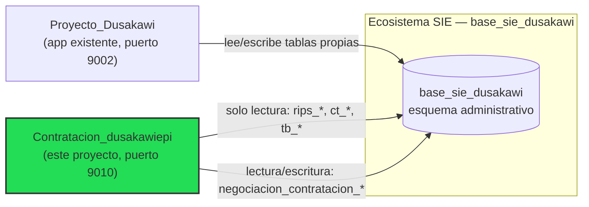

# Visión General

> [!info] Resumen
> **Contratacion_dusakawiepi** es el *Sistema de Inteligencia de Precios para Negociación de Contratos* del Área de Contratación de **DUSAKAWI EPSI**. Analiza, compara y genera información estratégica sobre tarifas CUPS, CUM, medicamentos e insumos usados para negociar contratos con la red prestadora.

## Qué es

Una plataforma de Business Intelligence enfocada en un único dominio: **el precio y el consumo asociados a los contratos con prestadores de salud**. No es un sistema de facturación ni de autorizaciones — consume datos ya existentes de esos procesos (RIPS, tarifarios, contratos) para producir análisis que apoyan la negociación.

## De dónde viene

Existía previamente un componente de "Gestión de Inteligencia de Precios" embebido como una pestaña dentro del *Módulo de Analítica de Datos* del ecosistema `Proyecto_Dusakawi`. Ese componente:

- Tenía lógica de negocio valiosa (comparación estadística, semáforo de variación, matching prestador↔RIPS) mezclada con **3.348 líneas** de un solo archivo `.tsx`.
- Usaba un login hardcodeado de 2 usuarios en `sessionStorage` — no apto para operar como sistema independiente.
- Dependía de cargas manuales de Excel/Google Sheets para tener una comparación "2025 vs 2026", que en realidad era una foto congelada, no una serie histórica real.

Este proyecto nace para **rescatar el conocimiento de negocio validado** (fórmulas de ahorro, semáforos, estrategias de matching) y reconstruirlo como una aplicación propia, con arquitectura limpia y series temporales reales.

## Relación con el ecosistema Dusakawi

Es un **proyecto de aplicación independiente** (repositorio, deploy y código separados), pero comparte la misma base de datos física porque los datos maestros (tarifarios, contratos, RIPS) no deben duplicarse. Ver el detalle de esta decisión en [[Decisiones ADR]].

## Estado actual

> [!warning] Fase 0 (Fundación) + Módulo 1 (Tarifario Vigente e Histórico) — completados
> Scaffold Next.js 15 + autenticación propia + estructura base, **más** el primer módulo de análisis real: `/tarifarios` (listado de contratos con filtros/paginación) y `/tarifarios/[id]` (detalle con pestañas Procedimientos/Medicamentos/Insumos/Paquetes/Otros), consultando ARYUWIS en vivo. **Los módulos 2 a 8 siguen sin implementar.** Ver [[Roadmap]] y [[Pendientes]].

## Documentos relacionados

- [[Objetivos]]
- [[Roadmap]]
- [[Arquitectura General]]
- [[Glosario]]
