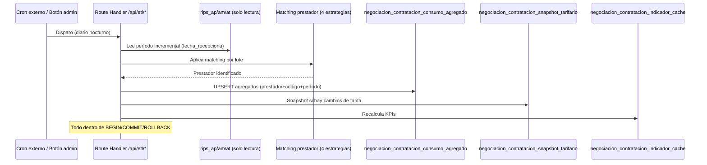

# Arquitectura General

> [!info] Fuente primaria
> Este documento resume y enlaza `docs/ARQUITECTURA.md` (propuesta de arquitectura funcional y técnica, aprobada 2026-07-27). Es el documento vivo de referencia del equipo — cualquier cambio de arquitectura real debe reflejarse primero ahí y luego aquí.

## 1. Por qué existe este proyecto

Ver contexto completo en [[Visión General]]. En resumen: rescata lógica de negocio validada de un componente legado (`contracted-price-search-dsk.tsx`, 3.348 líneas) y la reconstruye como aplicación independiente con series temporales reales en vez de "fotos congeladas" 2025 vs 2026.

## 2. Restricción de rendimiento que condiciona la arquitectura

Las tablas fuente de consumo real (RIPS) son enormes y **no están indexadas** para este caso de uso:

| Tabla | Filas aprox. | Índice sobre código/fecha |
|---|---:|---|
| `rips_ap` (procedimientos) | ~177.7 M | No |
| `rips_am` (medicamentos) | ~81.8 M | No |
| `rips_at` (insumos) | ~60.1 M | No |
| `tb_tarifario_propio_detalle` | ~1.45 M | Solo por `consecutivo_cup/medicamento/insumo/paquete` |

> [!danger] Consecuencia arquitectónica
> Consultar estas tablas en vivo en cada carga de dashboard **no escala**. Por eso la arquitectura se apoya en un **ETL propio** que pre-agrega hacia el esquema `negociacion_contratacion_*`, dejando la consulta en vivo solo para drill-down puntual. Ver [[Procedimientos]] y la estrategia ETL en [[Arquitectura General#3. Estrategia ETL]].

## 3. Estrategia ETL

Proceso batch (Route Handler `/api/etl/*`, disparado por cron externo o botón manual) que:

1. Lee `rips_ap/am/at` del período faltante (incremental por `fecha_recepciona`, nunca full scan).
2. Aplica el matching prestador↔RIPS (4 estrategias de fallback, ver [[Patrones#Matching prestador↔RIPS]]) una sola vez por lote.
3. Escribe/actualiza `negociacion_contratacion_consumo_agregado`.
4. Toma snapshot del tarifario vigente hacia `negociacion_contratacion_snapshot_tarifario` si detecta cambios contra el último snapshot.
5. Recalcula `negociacion_contratacion_indicador_cache`.

Todo transaccional (`BEGIN/COMMIT/ROLLBACK`). **Estado actual: diseñado, no implementado** (Fase 0 no incluye ETL — ver [[Roadmap]]).



## 4. Módulos funcionales

| # | Módulo | Objetivo de negocio | Depende de | Estado |
|---|---|---|---|---|
| 0 | **Fundación** | Login, sesión, estructura base | — | ✅ Implementado |
| 1 | **Tarifario Vigente e Histórico** | Consultar el tarifario vigente contratado por prestador (Procedimientos/Medicamentos/Insumos/Paquetes/Otros), con búsqueda, paginación server-side y export | Consulta en vivo a ARYUWIS (sin ETL de snapshot) | ✅ **Implementado** (2026-07-28) |
| 2 | **Comparativo entre Prestadores** | Comparar tarifas de un mismo CUPS/CUM/Insumo entre prestadores del mismo municipio (media/mediana/semáforo configurable) | Módulo 1 | ✅ **Implementado** (2026-07-28) |
| 3 | **Consumo y Frecuencia** | Analizar consumos y frecuencias | ETL de consumo agregado | ⏳ Planificado |
| 4 | **Sobrecostos y Oportunidades de Ahorro** | Detectar sobrecostos, analizar costos | Módulos 1 + 3 | ⏳ Planificado |
| 5 | **Simulador de Escenarios de Negociación** | Simular escenarios | Módulos 1 + 3 + 4 | ⏳ Planificado |
| 6 | **Benchmark de Mercado Externo** | Referencia objetiva de mercado | Ingesta batch propia | ⏳ Planificado (Fase 6, fuera de alcance inicial) |
| 7 | **Dashboard Ejecutivo** | Indicadores estratégicos, apoyo pre-negociación | Todos los anteriores | ⏳ Placeholder visual en `/dashboard` |
| 8 | **Administración** | Usuarios, auditoría, exclusiones de calidad de datos | Transversal | ⏳ Planificado (solo tabla de usuarios existe) |

## 5. Estructura de carpetas del código fuente

```
src/
├── app/
│   ├── (protegido)/           # Rutas autenticadas — layout valida sesión
│   │   ├── dashboard/         # Panel con tarjetas de módulos (Tarifario y Comparativo ya "Disponible")
│   │   ├── tarifarios/        # ✅ Módulo 1 — listado (page.tsx) y detalle ([id]/page.tsx)
│   │   ├── comparativo/       # ✅ Módulo 2 — page.tsx (comparativo entre prestadores por municipio)
│   │   └── layout.tsx         # Header + validación de sesión (defensa en profundidad)
│   ├── actions/
│   │   ├── auth-actions.ts    # loginAction, logoutAction
│   │   ├── tarifario-actions.ts # ✅ listContratos, getContratoDetalle, getTarifario{Servicios,Otros,Medicamentos,Insumos,Paquetes}, getConteosTarifario, getOpcionesFiltro
│   │   └── comparativo-actions.ts # ✅ getOpcionesMunicipios, getComparativoPorMunicipio, getComparativoPorCodigo
│   ├── api/
│   │   └── export/tarifario/route.ts # ✅ Route Handler: exporta Excel/CSV del tarifario activo (reutiliza las Server Actions de lectura)
│   ├── login/                 # Página + formulario de login
│   ├── layout.tsx             # Root layout
│   └── page.tsx               # Landing pública ("Ingresar")
├── components/
│   ├── ui/                    # Primitivos Shadcn (badge, button, card, input, label, select, table, tabs)
│   ├── tarifarios/            # ✅ FiltrosContrato, Paginacion (reutilizada por Módulo 2), TablaTarifario (genérica), TarifarioDetalleClient
│   ├── comparativo/           # ✅ ComparativoClient (selects de municipio/tipo, panel de umbrales, 2 pestañas, filas expandibles con semáforo)
│   └── logout-button.tsx
├── lib/
│   ├── auth.ts                # Sesión (cookie), hash SHA-256, jerarquía de roles
│   ├── db.ts                  # Proxy HTTP hacia PostgreSQL
│   ├── negociacion/
│   │   ├── formato.ts         # ✅ resolverValorFinal, esContratoVigente, formatearMoneda/Porcentaje/Fecha, descripcionReferenciaManual
│   │   ├── exportar.ts        # ✅ construirCsv, construirLibroExcel (ExcelJS) — funciones puras de exportación
│   │   └── comparativo.ts     # ✅ calcularEstadisticas, calcularVariacionPct, clasificarSemaforo, dedupMejorPrecio
│   └── utils.ts                # cn() — helper de clases Tailwind
├── types/
│   ├── tarifarios.ts          # ✅ Tipos del Módulo 1 (ContratoListado/Detalle, TarifaServicioRow, etc.)
│   └── comparativo.ts         # ✅ Tipos del Módulo 2 (TipoComparativo, OpcionMunicipio, FilaComparativoCodigo, UmbralesSemaforo)
└── middleware.ts               # Redirige a /login si no hay sesión (matcher ya incluía /tarifarios/:path* y /comparativo/:path*)
```

Comparar con la **estructura objetivo completa** (con todos los módulos) documentada en `docs/ARQUITECTURA.md` §2.3 — incluye carpetas `consumo/`, `sobrecostos/`, `simulador/`, `benchmark/`, `admin/`, `api/etl/`, `lib/etl/`, `lib/matching-prestador.ts` que **aún no existen**. `lib/negociacion/` y `api/export/` sí se materializaron, ampliándose de Módulo 1 a Módulo 2.

## 6. Principios no negociables

Ver [[Objetivos#Principios no negociables]].

## Ver también
- [[Tecnologías]]
- [[Patrones]]
- [[Decisiones ADR]]
- [[Diagramas]]
- [[Modelo ER]]
