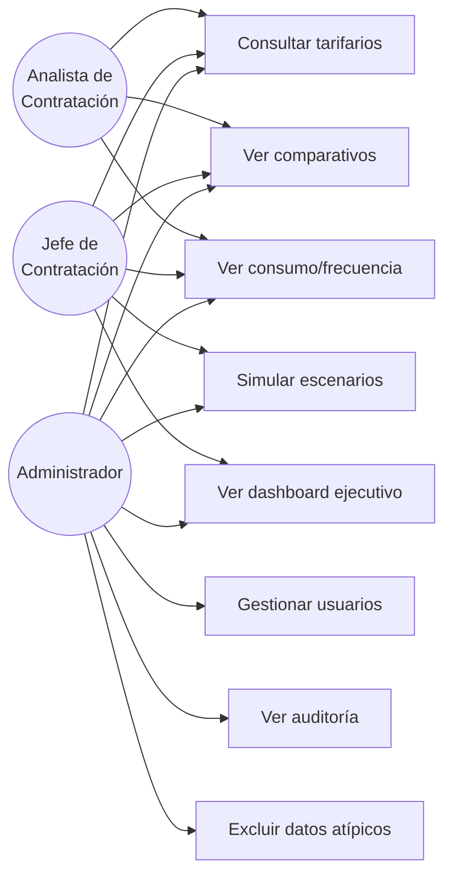

# Diagramas

Índice central de todos los diagramas Mermaid de la base de conocimiento. Cada diagrama vive en el documento más relevante a su tema; aquí se referencian para navegación rápida.

## Arquitectura general del ecosistema

Ver [[Visión General#Relación con el ecosistema Dusakawi]] — relación entre `Proyecto_Dusakawi`, `Contratacion_dusakawiepi` y `base_sie_dusakawi`.

## Flujo ETL (planificado)

Ver [[Arquitectura General#3. Estrategia ETL]] — secuencia cron → lectura RIPS → matching → agregación → snapshot → cache.

## Flujo de reintentos del proxy de base de datos

Ver [[Patrones#Proxy HTTP en vez de conexión directa a PostgreSQL]] — distinción cold start vs. timeout de query pesada.

## Flujo de autenticación (login)

Ver [[Flujo Login]] — diagrama de secuencia completo cliente → Server Action → BD → cookie.

## Navegación entre rutas protegidas

```mermaid
graph TD
    Root["/ (landing pública)"] --> Login["/login"]
    Login -->|loginAction exitoso| Dashboard["/dashboard"]
    Middleware{{"middleware.ts<br/>valida cookie de sesión"}}
    Middleware -.protege.-> Dashboard
    Middleware -.protege.-> Tarifarios["/tarifarios ✅"]
    Middleware -.protege.-> Comparativo["/comparativo ✅"]
    Middleware -.protege.-> Historico["/historico-prestador ✅"]
    Middleware -.protege.-> Perfil["/perfil-prestador ✅"]
    Middleware -.protege.-> Consumo["/consumo-frecuencia ✅"]
    Middleware -.protege.-> TopImpacto["/top-impacto ✅"]
    Middleware -.protege.-> Propuesta["/analisis-propuesta ✅"]
    Middleware -.protege.-> RefEps["/precio-referencia-eps ✅"]
    Middleware -.protege.-> Simulador["/simulador (planificado)"]
    Middleware -.protege.-> Benchmark["/benchmark (planificado)"]
    Middleware -.protege.-> Admin["/admin (planificado)"]

    Dashboard -->|logoutAction| Login

    style Dashboard fill:#2d5,stroke:#333
    style Login fill:#2d5,stroke:#333
    style Root fill:#2d5,stroke:#333
    style Tarifarios fill:#2d5,stroke:#333
    style Comparativo fill:#2d5,stroke:#333
    style Historico fill:#2d5,stroke:#333
    style Perfil fill:#2d5,stroke:#333
    style Consumo fill:#2d5,stroke:#333
    style TopImpacto fill:#2d5,stroke:#333
    style Propuesta fill:#2d5,stroke:#333
    style RefEps fill:#2d5,stroke:#333
```

> [!note] Actualizado 2026-08-02
> 8 módulos de análisis ya tienen página implementada (`✅`) — ver [[Páginas]] para el detalle de cada uno. Solo `/simulador`, `/benchmark` y `/admin` siguen en el `matcher` de `middleware.ts` (ya protegidas de antemano) sin página construida todavía.

## Diagrama Entidad-Relación (parcial + planificado)

Ver [[Modelo ER]] para el diagrama completo con las 11 tablas del esquema `negociacion_contratacion_*`.

## Casos de uso por rol

> [!warning] Actualizado 2026-08-02
> Este diagrama refleja la **jerarquía de roles diseñada** (`tieneRolMinimo()` en `src/lib/auth.ts`: `analista < jefe_contratacion < admin`). UC1 (Tarifarios), UC2 (Comparativos, incluye Dashboard de Riesgo/Perfil del Prestador/Top Impacto/Análisis de Propuesta/Precios de Referencia EPS) y UC3 (Consumo/Frecuencia) ya tienen UI implementada — ver [[Páginas]]. UC4 (Simular escenarios), UC6 (Gestionar usuarios) y UC7 (Ver auditoría) siguen sin construir. UC8 (Excluir datos atípicos) tampoco existe. La única acción con gate de rol real hoy es el botón "Aplicar migración" de Precios de Referencia EPS (rol `admin`) — `tieneRolMinimo()` no se usa en ningún otro flujo todavía, ver [[Autorizaciones]].

## Ver también
- [[Arquitectura General]]
- [[Modelo ER]]
- [[Flujo Login]]
