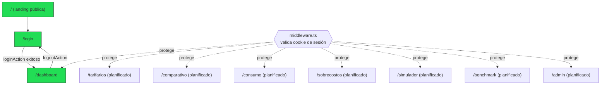
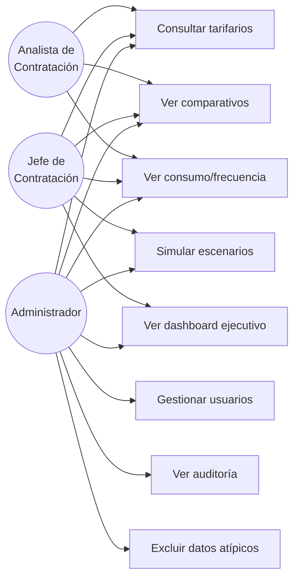

# Diagramas

Índice central de todos los diagramas Mermaid de la base de conocimiento. Cada diagrama vive en el documento más relevante a su tema; aquí se referencian para navegación rápida.

## Arquitectura general del ecosistema

Ver [[Visión General#Relación con el ecosistema Dusakawi]] — relación entre `Proyecto_Dusakawi`, `Contratacion_dusakawiepi` y `base_sie_dusakawi`.

## Flujo ETL (planificado)

Ver [[Arquitectura General#3. Estrategia ETL]] — secuencia cron → lectura RIPS → matching → agregación → snapshot → cache.

## Flujo de reintentos del proxy de base de datos

Ver [[Patrones#Proxy HTTP en vez de conexión directa a PostgreSQL]] — distinción cold start vs. timeout de query pesada.

## Flujo de autenticación (login)

Ver [[Flujo Login]] — diagrama de secuencia completo cliente → Server Action → BD → cookie.

## Navegación entre rutas protegidas

> [!note]
> Solo `/`, `/login` y `/dashboard` existen hoy en código. El resto de rutas están en el `matcher` de `middleware.ts` (ya protegidas de antemano) pero sus páginas aún no se han construido.

## Diagrama Entidad-Relación (parcial + planificado)

Ver [[Modelo ER]] para el diagrama completo con las 11 tablas del esquema `negociacion_contratacion_*`.

## Casos de uso por rol

> [!warning]
> Este diagrama refleja la **jerarquía de roles diseñada** (`tieneRolMinimo()` en `src/lib/auth.ts`: `analista < jefe_contratacion < admin`). Los casos de uso UC1-UC8 corresponden a los módulos planificados; ninguno tiene UI implementada todavía salvo el login/logout.

## Ver también
- [[Arquitectura General]]
- [[Modelo ER]]
- [[Flujo Login]]
