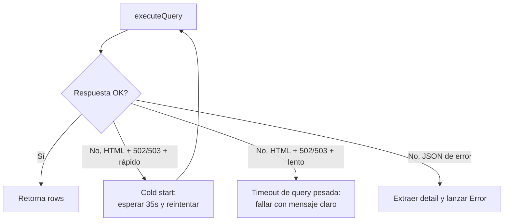

# Patrones de diseño

## Proxy HTTP en vez de conexión directa a PostgreSQL

`src/lib/db.ts` no usa un driver `pg` con conexión TCP directa: hace `fetch()` a `https://pg-proxy.onrender.com/query`.

**Por qué**: el hosting de despliegue (Vercel u otro) tiene IP dinámica; el firewall de `base_sie_dusakawi` solo autoriza la IP estática del proxy desplegado en Render. Ver detalle completo en [[APIs Externas]].

Patrón de reintento incorporado:
- 3 intentos máximo, con distinción entre **cold start de Render** (502/503 rápido → reintentar tras 35s) y **timeout real de gateway sobre una query pesada** (502/503 lento → no reintentar, fallar con mensaje claro).
- Cada query lleva un `source` opcional que la etiqueta en `pg_stat_activity` como `Contratacion_dusakawiepi/<source>`, para diferenciarla de las queries de `Proyecto_Dusakawi` que comparten el mismo proxy/BD.

## Autenticación propia (cookie de sesión), no NextAuth/Supabase Auth

Decisión confirmada en `docs/ARQUITECTURA.md` §7. Ver flujo completo en [[Autenticación]] y [[Flujo Login]].

- Cookie httpOnly con JSON de sesión (`userId`, `username`, `nombreCompleto`, `rol`), 8 horas de expiración (jornada laboral).
- Password hasheado con SHA-256 hex — **mismo patrón** que `administrativo.usuarios_tarifario` del resto del ecosistema (consistencia, no necesariamente el estándar criptográfico más fuerte disponible hoy — ver [[Problemas Comunes]]).
- Defensa en profundidad: el middleware protege las rutas por matcher, **y además** el layout de `(protegido)` vuelve a validar la sesión en el Server Component, por si una llamada futura no pasa por el middleware.

## Matching prestador↔RIPS (4 estrategias de fallback)

Documentado en `docs/ARQUITECTURA.md` §1.1 como **conocimiento de dominio ya validado**, a reutilizar tal cual (no reescribir desde cero) cuando se implemente el Módulo 3 (Consumo). No existe llave única limpia entre el maestro de prestadores y los RIPS, así que se prueban en cascada:

1. Código de habilitación.
2. NIT completo.
3. NIT sin los últimos 3 dígitos.
4. NIT sin ceros.

> [!todo] Estado
> Estrategia documentada, **no implementada aún** en código (no existe `src/lib/matching-prestador.ts` todavía).

## Server Actions por dominio, no un archivo gigante

`src/app/actions/auth-actions.ts` es el primer ejemplo del patrón: una Server Action por dominio funcional (`auth-actions.ts`, y en el futuro `tarifario-actions.ts`, `comparativo-actions.ts`, `consumo-actions.ts`, `simulador-actions.ts`, `admin-actions.ts`). Corrige explícitamente el defecto del componente legado (`db-actions.ts` con 14 funciones mezcladas).

## Lógica de negocio pura, separada de la UI

Todo cálculo estadístico/financiero (semáforos de variación, fórmulas de ahorro, umbrales) debe vivir como función pura y testeable en `src/lib/negociacion/`, nunca inline en un componente `.tsx`. **Aún no existe esta carpeta** — es un principio para cuando se construyan los Módulos 1-5. Ver [[Validaciones]].

## Ver también
- [[Arquitectura General]]
- [[Autenticación]]
- [[Decisiones ADR]]
