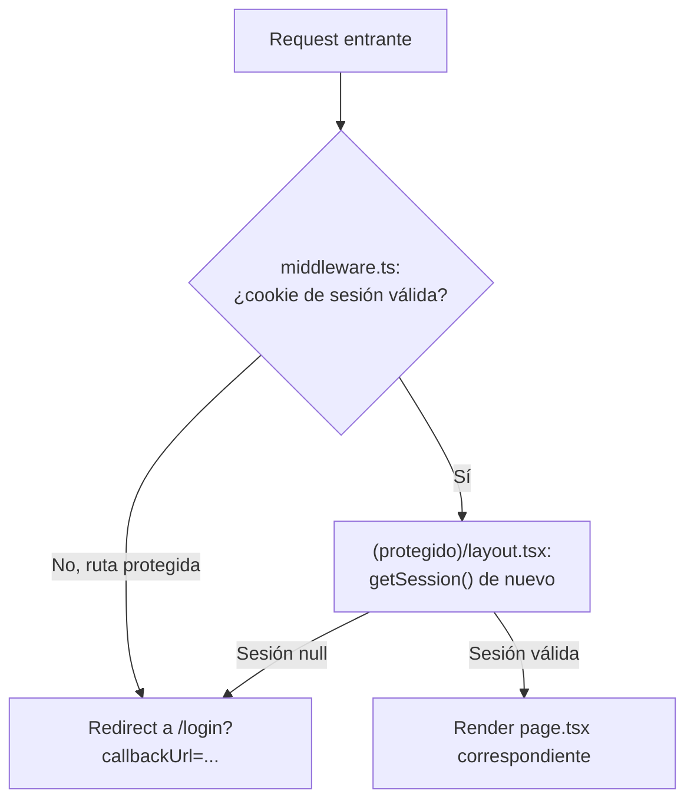

# Controladores

> [!note] Equivalente en Next.js App Router
> Este proyecto no usa un patrón MVC tradicional con "controladores". El rol equivalente lo cumplen los **Server Components de página/layout**, que orquestan sesión, datos y renderizado antes de entregar HTML al cliente.

## Propósito
Documentar los puntos donde el servidor decide qué mostrar/redirigir según el estado de sesión — el equivalente más cercano a un controlador en este stack.

## Inventario

### `src/middleware.ts`
- **Responsabilidad**: interceptar requests a rutas protegidas y redirigir a `/login` si no hay cookie de sesión válida.
- **Archivos involucrados**: `src/middleware.ts`.
- **Rutas que protege** (`config.matcher`): `/dashboard/*`, `/tarifarios/*`, `/comparativo/*`, `/consumo/*`, `/sobrecostos/*`, `/simulador/*`, `/benchmark/*`, `/admin/*`.
- Ver detalle completo en [[Middleware]].

### `src/app/(protegido)/layout.tsx`
- **Responsabilidad**: segunda validación de sesión (defensa en profundidad) + render del header con datos del usuario (`nombreCompleto`, `rol`) + botón de logout.
- **Dependencias**: `getSession()` de `lib/auth.ts`, `LogoutButton`.
- **Flujo de ejecución**:
  1. Llama `getSession()`.
  2. Si no hay sesión, `redirect("/login")` — nunca confía en que el middleware ya filtró.
  3. Si hay sesión, renderiza header con `rolLabel` mapeado (`analista` → "Analista de Contratación", etc.) y `{children}`.

### `src/app/(protegido)/dashboard/page.tsx`
- **Responsabilidad**: Server Component que obtiene la sesión (`getSession()`) y renderiza el listado estático de los 8 módulos funcionales con su estado (`"Siguiente fase"`, `"Próximamente"`, `"Fase 6"`).
- **Nota**: no consulta ningún dato real todavía — es 100% contenido estático hasta que se implemente el Módulo 1.

### `src/app/login/page.tsx`
- **Responsabilidad**: renderiza el layout de login y delega el formulario interactivo a `LoginForm` (Client Component), envuelto en `<Suspense>` porque usa `useSearchParams()`.

## Diagrama de flujo de control

## Problemas conocidos
Ninguno documentado aún — módulo pequeño y estable.

## Posibles mejoras
- Cuando existan más módulos, considerar un helper compartido `requireRole(rolMinimo)` que combine `getSession()` + `tieneRolMinimo()` + `redirect()`, para no repetir la lógica en cada página nueva.

## Ver también
- [[Middleware]]
- [[Páginas]]
- [[Autenticación]]
