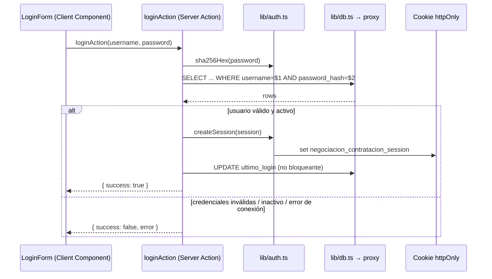

# Servicios

## Propósito
Encapsular la lógica de acceso a datos y reglas de aplicación en el servidor, separada de la UI (`.tsx`), usando el patrón **Server Actions por dominio** (ver [[Patrones#Server Actions por dominio, no un archivo gigante]]).

## Responsabilidad
Cada archivo `*-actions.ts` en `src/app/actions/` cubre un dominio funcional completo (autenticación, y en el futuro tarifario, comparativo, consumo, simulador, admin).

## Dependencias
- `src/lib/db.ts` → [[Middleware#src/lib/db.ts|pool.query / executeQuery]]
- `src/lib/auth.ts` → sesión y hash de contraseñas

## Inventario de servicios

### `auth-actions.ts` (implementado)

| Función | Descripción |
|---|---|
| `loginAction(username, password)` | Valida credenciales contra `negociacion_contratacion_usuario`, crea sesión, actualiza `ultimo_login` | 
| `logoutAction()` | Destruye la sesión |

Ver contrato completo en [[API#Endpoint actual: Server Action de autenticación]].

### Servicios planificados (no implementados)

| Archivo | Dominio | Módulo |
|---|---|---|
| `tarifario-actions.ts` | Consulta de tarifario vigente/histórico, gestión de snapshots | Módulo 1 |
| `comparativo-actions.ts` | Comparación estadística entre prestadores (media/mediana, semáforo) | Módulo 2 |
| `consumo-actions.ts` | Consulta de consumo agregado por prestador/código/período | Módulo 3 |
| `simulador-actions.ts` | CRUD de escenarios y rondas de negociación | Módulo 5 |
| `admin-actions.ts` | Gestión de usuarios, auditoría, exclusiones de calidad de datos | Módulo 8 |

## Flujo de ejecución (login, caso implementado)

## Problemas conocidos
- No hay rate limiting ni bloqueo tras intentos fallidos — ver [[Problemas Comunes]].
- El error de "tabla no existe" se confunde en el mismo mensaje con "proxy no disponible" — dificulta diagnóstico exacto al usuario final.

## Posibles mejoras
- Agregar rate limiting por IP/usuario a `loginAction`.
- Separar el registro de auditoría de login en `negociacion_contratacion_log_auditoria` (tabla planificada, ver [[Tablas]]) en vez de solo actualizar `ultimo_login`.

## Ver también
- [[API]]
- [[Autenticación]]
- [[Controladores]]
