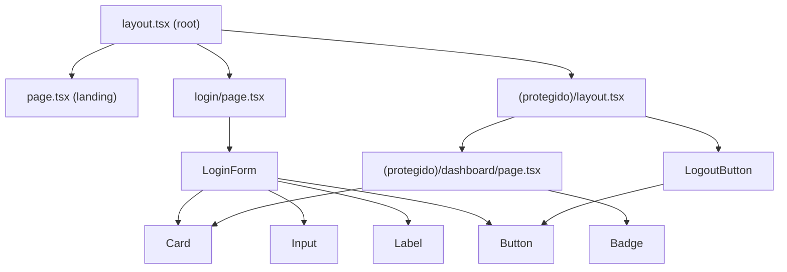

# Componentes

## Propósito
Inventariar todos los componentes React existentes hoy en `src/components/`. El proyecto está en Fase 0, por lo que el inventario es corto — crecerá un módulo a la vez según [[Roadmap]].

## Componentes UI (Shadcn/Radix) — `src/components/ui/`

| Componente | Archivo | Líneas | Base |
|---|---|---:|---|
| `Badge` | `badge.tsx` | 29 | `class-variance-authority` |
| `Button` | `button.tsx` | 47 | `@radix-ui/react-slot` + `cva` |
| `Card` (+ `CardHeader`, `CardTitle`, `CardDescription`, `CardContent`) | `card.tsx` | 35 | Composición simple con `cn()` |
| `Input` | `input.tsx` | 22 | `<input>` estilizado |
| `Label` | `label.tsx` | 17 | `@radix-ui/react-label` |
| `Select` ✅ | `select.tsx` | — | `<select>` nativo estilizado (deliberadamente sin `@radix-ui/react-select`, para no sumar otra dependencia solo para filtros de una opción) |
| `Table` (+ `TableHeader/Row/Head/Body/Cell`) ✅ | `table.tsx` | — | Tailwind puro, sin dependencia nueva |
| `Tabs` (+ `TabsList/Trigger/Content`) ✅ | `tabs.tsx` | — | `@radix-ui/react-tabs` |

Son los primitivos estándar de Shadcn UI, copiados sin modificaciones sustanciales del resto del ecosistema Dusakawi (mismo design system, para que el equipo no reaprenda nada — ver [[Tecnologías]]).

## Componentes de aplicación

### `LogoutButton`
- **Archivo**: `src/components/logout-button.tsx`.
- **Tipo**: Client Component (`"use client"`).
- **Propósito**: botón que ejecuta `logoutAction()`, redirige a `/login` y refresca el router.
- **Dependencias**: `useTransition` (estado de carga), `useRouter`, `Button` (UI), `logoutAction`.
- **Estados**: `isPending` (muestra ícono `Loader2` girando mientras se ejecuta el logout).

```tsx
const handleLogout = () => {
  startTransition(async () => {
    await logoutAction();
    router.push("/login");
    router.refresh();
  });
};
```

### `LoginForm`
- **Archivo**: `src/app/login/login-form.tsx`.
- **Tipo**: Client Component.
- **Propósito**: formulario de usuario/clave que invoca `loginAction`.
- **Dependencias**: `useState` (username, password, error), `useTransition`, `useRouter`, `useSearchParams`, componentes `Card`/`Input`/`Label`/`Button`.
- **Flujo**: ver [[Flujo Login]].
- **Nota de diseño**: no usa `react-hook-form` ni `zod` pese a estar instalados como dependencia — validación actual es solo `required` de HTML + chequeo de vacíos en el servidor (`loginAction`). Ver [[Problemas Comunes]] y oportunidad en [[Mejoras]].

## Componentes del Módulo 1 — `src/components/tarifarios/` ✅

| Componente | Archivo | Tipo | Propósito |
|---|---|---|---|
| `FiltrosContrato` | `filtros-contrato.tsx` | Client | Búsqueda con debounce + selects de vigencia/estado/tipo de contratación; actualiza la URL (`router.push`) sin recarga completa |
| `Paginacion` | `paginacion.tsx` | Client | Control reutilizable con **dos modos**: `baseHref`+`queryParams` (datos planos, para páginas Server Component — nunca una función, no es serializable por el RSC boundary) o `onPageChange` (callback, para estado en cliente) |
| `TablaTarifario<T>` | `tabla-tarifario.tsx` | Client, genérico | Tabla reutilizada por las 5 pestañas del detalle: búsqueda con debounce, paginación server-side vía Server Action, botones Excel/CSV/Imprimir. Parametrizada por `cargarPagina` (la Server Action) y `columnas` |
| `TarifarioDetalleClient` | `tarifario-detalle-client.tsx` | Client | Orquesta las 5 pestañas (`Tabs` de Radix) sobre `TablaTarifario`, con las columnas específicas de cada tipo |

> [!note] Por qué `Paginacion` no acepta una función como prop
> Un intento inicial pasaba `hrefForPage: (page) => string` desde el Server Component `/tarifarios/page.tsx` — Next.js falló con *"Functions cannot be passed directly to Client Components"*. Los Server Components solo pueden pasar props serializables a un Client Component; se corrigió pasando `baseHref` (string) + `queryParams` (objeto plano) y armando el `href` **dentro** del Client Component.

## Componentes planificados (no existen aún)

Según `docs/ARQUITECTURA.md` §2.3, cuando se construyan los módulos existirán carpetas `components/comparativo/`, `components/consumo/`, `components/simulador/`, `components/benchmark/`, `components/dashboard/` — ninguna existe todavía.

## Diagrama de composición actual



## Problemas conocidos
- Ninguno bloqueante — inventario pequeño y estable.

## Posibles mejoras
- Migrar `LoginForm` a `react-hook-form` + `zod` (ya están instalados) para validación de cliente más robusta y consistente con el resto del ecosistema.
- Extraer las tarjetas de módulo del dashboard a un componente `ModuloCard` reutilizable cuando se agregue contenido dinámico real.

## Ver también
- [[Páginas]]
- [[Estados]]
- [[Hooks]]
