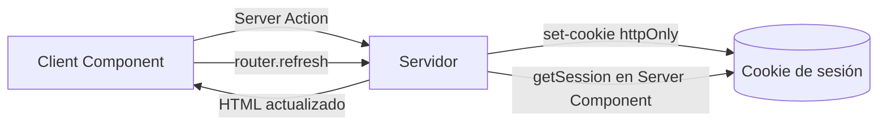

# Estados

## Propósito
Documentar cómo se maneja el estado en el frontend. **No hay gestor de estado global** (ni Redux, ni Zustand, ni Context API propio) — todo el estado es local a cada Client Component o vive en el servidor (sesión vía cookie).

## Estado local (Client Components)

| Componente | Estado | Tipo |
|---|---|---|
| `LoginForm` | `username`, `password` | `string` (controlado) |
| `LoginForm` | `error` | `string \| null` |
| `LoginForm` / `LogoutButton` | `isPending` | `boolean` (de `useTransition`) |

## Estado de sesión (servidor)

La "fuente de verdad" del estado de usuario autenticado **no vive en el cliente**: vive en la cookie httpOnly `negociacion_contratacion_session` (ver [[Autenticación]]), leída en cada Server Component vía `getSession()`. Esto significa:

- El cliente no puede leer ni modificar el estado de sesión directamente (httpOnly).
- Cualquier cambio de sesión requiere una Server Action (`loginAction`/`logoutAction`) + `router.refresh()` para que el Server Component vuelva a ejecutarse con el nuevo estado.

## Sin React Query / SWR

No hay librería de fetching/cache de datos en cliente instalada. Todo dato se obtiene en Server Components (`async function Page()`), consistente con el patrón de no exponer lógica de BD al cliente. Cuando se construyan los módulos de análisis con filtros interactivos, será necesario decidir si se introduce una librería de data-fetching en cliente o se mantiene 100% Server Components + Server Actions.

> [!todo] Decisión pendiente
> No hay ADR registrado sobre cómo se manejará el estado de filtros interactivos (fechas, prestador, código) en los dashboards de los módulos 1-7. Candidato a decisión de arquitectura antes de iniciar la Fase 1 — ver [[Pendientes]].

## Ver también
- [[Componentes]]
- [[Hooks]]
- [[Autenticación]]
