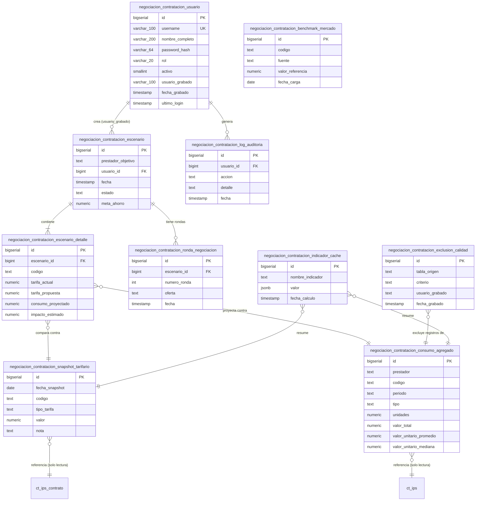

# Modelo ER

> [!info] Alcance
> Diagrama entidad-relación combinando: **(a)** la única tabla implementada (`negociacion_contratacion_usuario`), **(b)** las 10 tablas planificadas en `docs/ARQUITECTURA.md` §3.2, y **(c)** las tablas SIE existentes que se consultan de solo lectura (§3.1). Las tablas planificadas se marcan explícitamente — no representan un esquema aplicado en la BD.

## Diagrama completo

> [!warning] Nivel de detalle de columnas
> Las columnas de `negociacion_contratacion_usuario` son exactas (tomadas de la migración SQL aplicada). Las columnas del resto de tablas son **una interpretación razonable del rol descrito en `docs/ARQUITECTURA.md` §3.2** — ninguna de esas tablas tiene DDL escrito todavía. Antes de generar una migración real, el equipo de base de datos debe definir tipos y restricciones exactas.

## Tablas SIE existentes referenciadas (solo lectura, fuera de este esquema nuevo)

`ct_ips_contrato`, `ct_ips`, `tb_tarifario_propio_encabezado`, `tb_tarifario_propio_detalle`, `tb_cup`, `tb_medicamento`, `tb_insumo`, `tb_concepto_nota_tecnica`, `rips_ap`, `rips_am`, `rips_at`, `rips_resumen`, `rips_af`, `log_sc_factura_pago_detallado`. Ver detalle de uso en [[Tablas#Tablas SIE existentes]].

## Ver también
- [[Tablas]]
- [[Relaciones]]
- [[Índices]]
- [[Procedimientos]]
