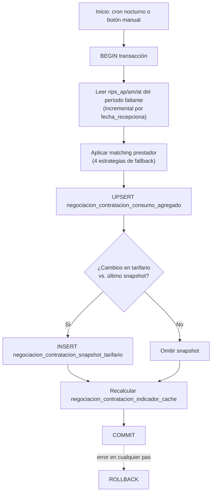

# Procedimientos, Vistas, Funciones y Triggers

## Estado actual

> [!warning]
> **No existen procedimientos almacenados, funciones, vistas ni triggers propios de este proyecto todavía.** Toda la lógica actual (autenticación) es SQL directo parametrizado ejecutado desde `executeQuery()` (ver [[Middleware#src/lib/db.ts — proxy de base de datos]]). No hay PL/pgSQL escrito.

## Por qué "sin ORM" no significa "sin lógica de datos"

El principio de arquitectura es **SQL nativo parametrizado desde la aplicación**, no procedimientos almacenados. La lógica de negocio (semáforos, umbrales, matching) vive planificada como **funciones puras en TypeScript** (`src/lib/negociacion/`), no en PL/pgSQL. Ver [[Patrones#Lógica de negocio pura, separada de la UI]].

## El ETL como "procedimiento" a nivel de aplicación

Aunque no es un stored procedure de PostgreSQL, el **ETL planificado** cumple ese rol operacional — es la pieza de procesamiento de datos más importante del proyecto. Ver diseño completo en [[Arquitectura General#3. Estrategia ETL]].

Resumen del algoritmo (Route Handler `/api/etl/*`, no implementado):

Mismo patrón transaccional (`BEGIN/COMMIT/ROLLBACK`) que `insertHistoricoChunk` del proyecto legado, ya validado en producción.

## Vistas planificadas

Ninguna definida formalmente. Candidato natural cuando exista el Módulo 7 (Dashboard Ejecutivo): una vista o consulta materializada sobre `negociacion_contratacion_indicador_cache` para servir el panel en milisegundos.

## Ver también
- [[Arquitectura General]]
- [[Tablas]]
- [[Servicios]]
