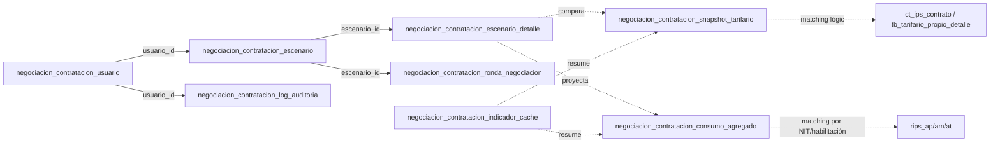

# Relaciones

## Relaciones implementadas

En el esquema propio (`negociacion_contratacion_*`): ninguna todavía — `negociacion_contratacion_usuario` sigue siendo la única tabla y no tiene FKs propias.

En el esquema SIE existente (solo lectura), el Módulo 1 ✅ sí usa relaciones reales y verificadas (`src/app/actions/tarifario-actions.ts`):

| Origen | Relación | Destino | Notas |
|---|---|---|---|
| `ct_ips_contrato.ips` | → | `ct_ips.ips` | Datos del prestador (razón social, NIT) |
| `ct_ips_contrato.tipo_contrato` | → | `tb_tipo_contrato.tipo_contrato` | Descripción del tipo de contratación |
| `ct_ips_contrato.modalidad_contrato` | → | `tb_modalidad_contrato.consecutivo_modalidad` | Descripción de modalidad |
| `ct_ips_contrato.consecutivo_tarifario_{servicio,medicamento,insumo}` | → | `tb_tarifario_propio_encabezado.consecutivo_tarifario` | Un contrato puede tener hasta 3 tarifarios distintos |
| `tb_tarifario_propio_detalle.consecutivo_tarifa` | → | `tb_tarifario_propio_encabezado.consecutivo_tarifario` | Líneas del tarifario |
| `tb_tarifario_propio_detalle.codigo_tarifa` | → | `tb_cup.codigo_interno` | **Join por código, no por FK** — `consecutivo_cup` siempre NULL, ver [[Tablas#Módulo 1 (Tarifario) — detalle real de tb_tarifario_propio_detalle]] |
| `tb_tarifario_propio_detalle.codigo_tarifa` | → | `tb_medicamento.codigo_interno` | **Join por código, no por FK** — `consecutivo_medicamento` está poblada pero casi siempre apunta al registro EQUIVOCADO (corregido 2026-07-28, ver mismo hallazgo en [[Tablas]]) |
| `tb_medicamento.marca_medicamento` | → | `tb_marca_medicamento.marca_medicamento` | Laboratorio |
| `tb_tarifario_propio_detalle.codigo_tarifa` | → | `tb_insumo.codigo_interno` | **Join por código, no por FK** — `consecutivo_insumo` siempre NULL, mismo patrón que `consecutivo_cup` |
| `tb_tarifario_propio_detalle.consecutivo_unidad` | → | `tb_unidad_medida.consecutivo_unidad_medida` | Unidad de medicamentos/insumos |
| `ct_ips_contrato.municipio_administracion` | → | `tb_municipio.municipio` | Código estilo DANE (varchar), no texto libre. **Es la relación correcta** para agrupar por ubicación en el Módulo 2 (comparativo/dashboard de riesgo/perfil del prestador) — corregido 2026-07-28→2026-07-30, ver hallazgo abajo |
| `ct_ips.municipio` | → | `tb_municipio.municipio` | Municipio de **registro/sede** del prestador (fijo por `ips`), distinto del municipio de administración de sus contratos. Se sigue usando para el municipio de "Análisis de Códigos de Mayor Impacto Económico" (RIPS por sede física), pero **ya no** para agrupar el Módulo 2 — ver [[Tablas#Módulo 2 (Comparativo)]] |
| `tb_municipio.departamento` | → | `tb_municipio.municipio` (self-join) | **`tb_municipio` es auto-referenciada**: `departamento` de un municipio es OTRO código de la misma tabla — para resolver el nombre del departamento hace falta un segundo join sobre `tb_municipio` (mismo patrón ya usado en el resto del ecosistema Dusakawi, ver `CLAUDE.md` de `Proyecto_Dusakawi`). Implementado en `getOpcionesMunicipios`/`getComparativoPorCodigo` de `src/app/actions/comparativo-actions.ts` |

## Relaciones planificadas

| Tabla origen | Relación | Tabla destino | Naturaleza |
|---|---|---|---|
| `negociacion_contratacion_escenario` | `usuario_id` → | `negociacion_contratacion_usuario.id` | FK explícita (quién creó el escenario) |
| `negociacion_contratacion_escenario_detalle` | `escenario_id` → | `negociacion_contratacion_escenario.id` | FK explícita, 1:N |
| `negociacion_contratacion_ronda_negociacion` | `escenario_id` → | `negociacion_contratacion_escenario.id` | FK explícita, 1:N |
| `negociacion_contratacion_log_auditoria` | `usuario_id` → | `negociacion_contratacion_usuario.id` | FK explícita |
| `negociacion_contratacion_snapshot_tarifario` | referencia lógica (no FK física, cruza esquemas de confianza distinta) → | `ct_ips_contrato` / `tb_tarifario_propio_detalle` | Relación de dominio, sin FK — son tablas de solo lectura externas al esquema propio |
| `negociacion_contratacion_consumo_agregado` | referencia lógica (matching por NIT/código habilitación, no FK) → | `ct_ips`, `rips_ap/am/at` | Relación resuelta en el ETL, no a nivel de constraint SQL |
| `negociacion_contratacion_exclusion_calidad` | referencia lógica → | `negociacion_contratacion_consumo_agregado` (o la tabla origen que se está excluyendo) | Por `tabla_origen` + `criterio`, no FK física |
| `negociacion_contratacion_indicador_cache` | resume datos de → | `negociacion_contratacion_consumo_agregado`, `negociacion_contratacion_snapshot_tarifario` | Derivada, recalculada por ETL |

> [!important] Por qué no todas son FK físicas
> Las relaciones hacia tablas SIE existentes (`ct_ips`, `rips_*`, `tb_*`) **no se implementan como Foreign Key de PostgreSQL** porque este proyecto tiene acceso de **solo lectura** sobre esas tablas y no controla su ciclo de vida ni su esquema. El "matching" (ver [[Patrones#Matching prestador↔RIPS]]) se resuelve en código de aplicación (ETL), no en el motor de base de datos.

## Diagrama de relaciones (ver también [[Modelo ER]])

## Ver también
- [[Tablas]]
- [[Modelo ER]]
- [[Procedimientos]]
