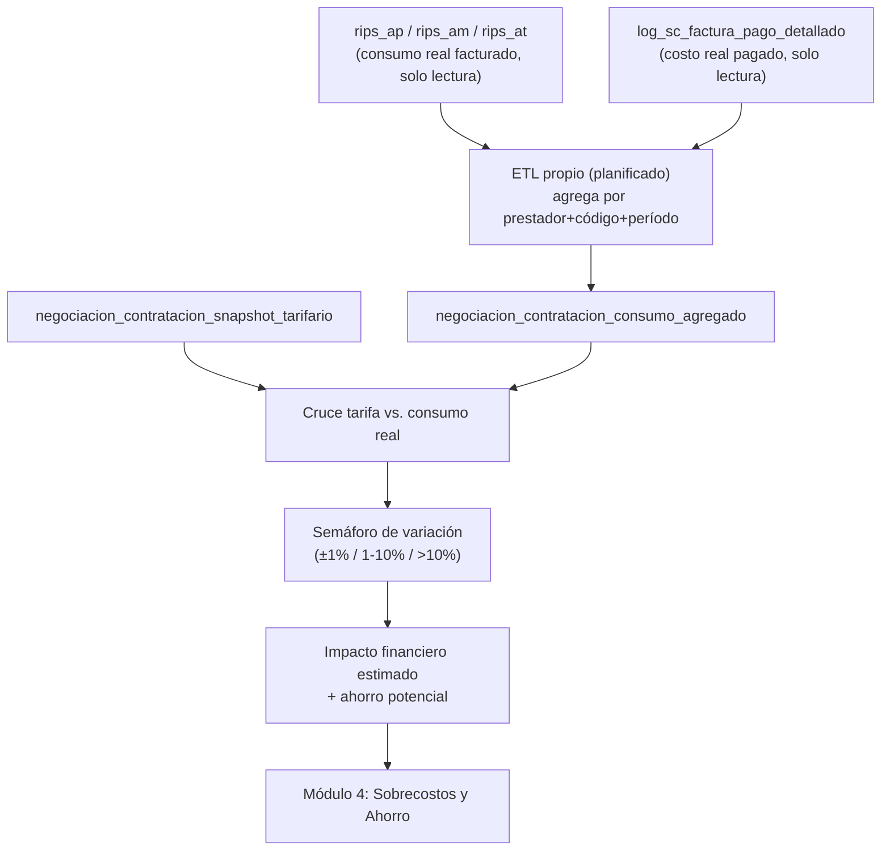

# Flujo Facturación (consumo real facturado — RIPS)

> [!note] Este proyecto no factura
> `Contratacion_dusakawiepi` **no es un sistema de facturación**. No emite facturas ni gestiona el ciclo de radicación/glosas. Consume, de **solo lectura**, los datos de facturación ya existentes (RIPS y pagos) generados por otros sistemas del ecosistema Dusakawi, para cruzarlos contra tarifas y estimar impacto financiero. Este documento describe ese flujo de consumo, no de emisión.

## Flujo planificado (Módulo 4 — Sobrecostos y Ahorro)

## Diferencia clave: "facturado" vs. "efectivamente pagado"

`docs/ARQUITECTURA.md` §3.1 señala explícitamente que `log_sc_factura_pago_detallado` existe para **diferenciar** cuánto se facturó (RIPS) de cuánto **efectivamente se pagó** — una glosa o descuento puede hacer que ambos valores difieran. El análisis de impacto financiero del Módulo 4 debe considerar ambos, no solo el valor facturado.

## Estado de implementación

> [!warning]
> No implementado. Depende de que existan primero: el ETL de agregación (Módulo 3), el snapshot de tarifario (Módulo 1) y las reglas de semáforo (ver [[Contratación]]). Ver orden completo en [[Roadmap]].

## Ver también
- [[Contratación]]
- [[Tablas]]
- [[Arquitectura General#3. Estrategia ETL]]
