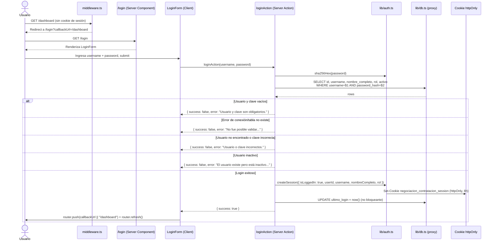
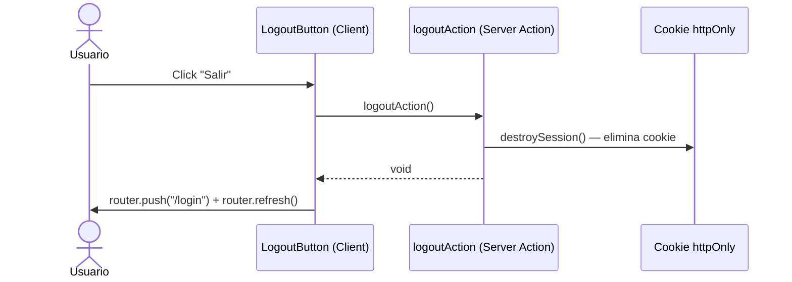

# Flujo Login

## Diagrama de secuencia completo

## Pasos narrados

1. Un usuario no autenticado intenta acceder a una ruta protegida (ej. `/dashboard`).
2. `middleware.ts` detecta ausencia/invalidez de la cookie `negociacion_contratacion_session` y redirige a `/login`, preservando la ruta original en `callbackUrl`.
3. El usuario completa el formulario (`LoginForm`, Client Component) y envía.
4. `loginAction` (Server Action) hashea la clave con SHA-256 y consulta `administrativo.negociacion_contratacion_usuario`.
5. Según el resultado, retorna éxito o uno de los 4 mensajes de error posibles (ver [[API#Endpoint actual: Server Action de autenticación]]).
6. En éxito: se crea la cookie de sesión (8 horas de duración), se actualiza `ultimo_login` (no bloqueante) y el cliente navega a `callbackUrl` o `/dashboard`.
7. El layout `(protegido)/layout.tsx` vuelve a validar la sesión (defensa en profundidad) antes de renderizar el contenido.

## Archivos involucrados
`src/middleware.ts`, `src/app/login/page.tsx`, `src/app/login/login-form.tsx`, `src/app/actions/auth-actions.ts`, `src/lib/auth.ts`, `src/lib/db.ts`, `src/app/(protegido)/layout.tsx`.

## Flujo de logout (complementario)

## Ver también
- [[Autenticación]]
- [[Servicios]]
- [[Componentes]]
