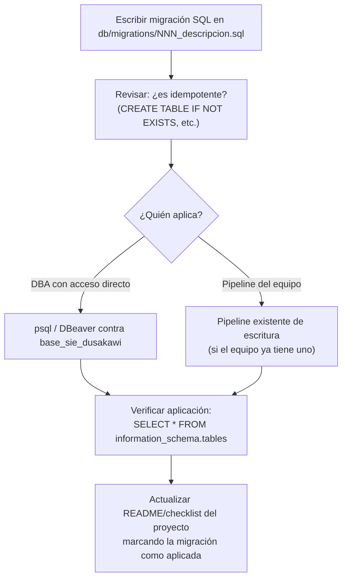

# Flujo Migración (aplicar cambios de esquema)

## Contexto

> [!warning] Restricción real ya enfrentada en este proyecto
> El agente/proceso que generó el scaffold inicial **no pudo aplicar** la migración `001_negociacion_contratacion_usuario.sql` porque: (1) el conector de solo lectura usado para análisis rechaza escrituras, y (2) el entorno de ejecución no tenía salida de red hacia el proxy de base de datos. Esto **no es un caso aislado** — cualquier migración futura de este proyecto enfrentará la misma restricción y debe aplicarse manualmente.

## Flujo actual (manual, obligatorio)

## Pasos concretos para la migración 001 (pendiente hoy)

1. Abrir `db/migrations/001_negociacion_contratacion_usuario.sql`.
2. Conectarse a `base_sie_dusakawi` con credenciales de **escritura** (no el proxy de solo lectura usado para análisis).
3. Ejecutar el script completo (`BEGIN ... COMMIT`). Es seguro reejecutar — usa `CREATE TABLE IF NOT EXISTS`.
4. Verificar la tabla: `SELECT * FROM administrativo.negociacion_contratacion_usuario LIMIT 1;`
5. Ejecutar `npm run seed:admin` (ver [[Flujo Registro]]) para crear el primer usuario.
6. Actualizar el checklist de `README.md` marcando el paso como completado.

## Convención de nomenclatura de migraciones

`db/migrations/NNN_descripcion_corta.sql` — numeración secuencial de 3 dígitos, snake_case descriptivo. Todas deben ser **idempotentes** siempre que sea razonable (`CREATE TABLE/INDEX IF NOT EXISTS`).

## Migraciones futuras esperadas

Una por cada tabla planificada en [[Tablas#Tablas planificadas]] — se numerarán `002`, `003`, etc., a medida que avance cada fase del [[Roadmap]].

## Ver también
- [[Tablas]]
- [[Pendientes]]
- [[Convenciones]]
