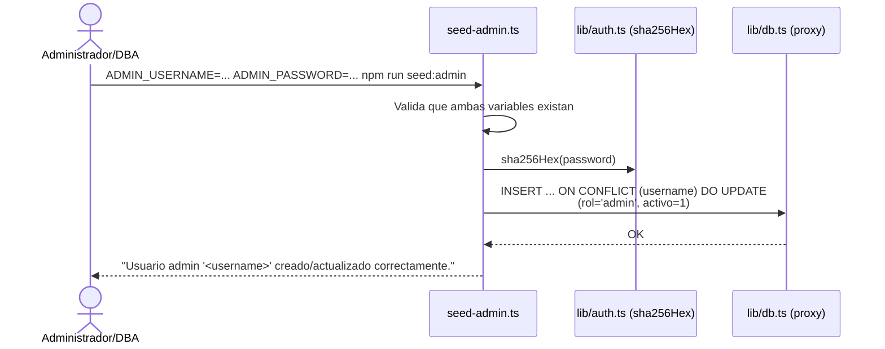

# Flujo Registro (creación de usuarios)

> [!note] No existe autorregistro
> Este sistema **no tiene un formulario público de "crear cuenta"** — es un sistema interno del Área de Contratación. La creación de usuarios ocurre por dos vías: el script de siembra inicial (`seed-admin.ts`) y, en el futuro, el Módulo 8 (Administración).

## Vía actual: `scripts/seed-admin.ts`

### Detalle
1. Requiere que la migración `001_negociacion_contratacion_usuario.sql` ya esté aplicada en la BD.
2. Se ejecuta manualmente, típicamente una sola vez por ambiente (dev/prod), para tener el primer usuario administrador.
3. La clave **nunca se guarda en texto plano** — solo se usa en memoria para calcular el hash SHA-256 antes del `INSERT`.
4. Es idempotente vía `ON CONFLICT (username) DO UPDATE`: volver a ejecutarlo con el mismo username actualiza el hash/rol/estado en vez de fallar por duplicado.

### Archivo
`scripts/seed-admin.ts` (ejecutado con `tsx` vía `npm run seed:admin`).

## Vía planificada: Módulo 8 — Administración

No implementada. Cuando exista, permitirá a un usuario con rol `admin` crear/editar/desactivar usuarios desde la UI (`/admin`), en vez de depender del script de línea de comandos para altas posteriores a la inicial.

## Ver también
- [[Autenticación]]
- [[Autorizaciones]]
- [[Flujo Login]]
